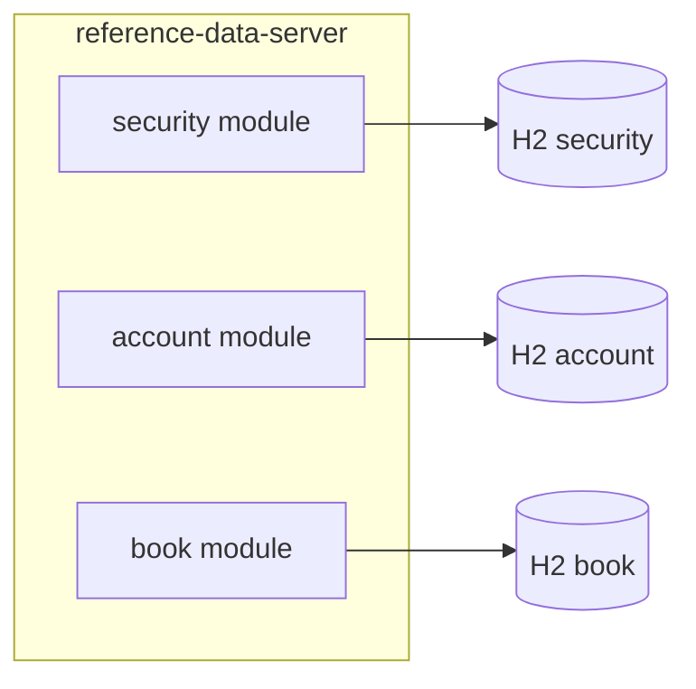

# Reference Data Service — Architecture

This document defines the **Reference Data** platform, its boundary from **Market Data**, modular **Security / Account / Book** ownership, the **HTTP API** contract ([reference-data-service-openapi.yaml](./api/reference-data-service-openapi.yaml)), and the **shared client library** used by domain services (e.g. Trade Capture, Position, Lifecycle) so they do not reimplement wire or cache logic.

Related: [trade_capture_service_design.md](./trade_capture_service_design.md), [equity_swap_trade_capture_implementation_design.md](./equity_swap_trade_capture_implementation_design.md).

---

## 1. Goals

- **Single source of truth** for slow-changing masters: **Security**, **Account**, **Book** (and later Party/Entity as needed).
- **Domain services consume via one SDK**: inject `ReferenceDataClient`, configure base URL and cache; no per-service Feign/RestTemplate duplication.
- **Over-the-wire or cached**: SDK supports direct GET/batch calls, optional **in-memory (Caffeine)** and optional **Redis** (extension point in client module).
- **Operational clarity**: correlation IDs, problem+json errors, metrics (latency, cache hit rate, circuit breaker).

---

## 2. Boundary: Reference Data vs Market Data

| Reference Data | Market Data |
|----------------|-------------|
| Identifiers, legal names, book/account attributes, instrument metadata | Prices, curves, vol surfaces, live quotes |
| Editorial / workflow; stronger consistency expectations | Staleness and latency SLAs; high read volume |
| This service + **Reference Data Client SDK** | Separate **Market Data Service** + future SDK |

The **Reference Data Client** must **not** embed pricing or streaming market APIs.

---

## 3. Modular monolith (initial deployment)

Three **logical modules** in one deployable (`reference-data-server`):

- **Security** — instrument id, RIC, ISIN, currency, asset type, etc.
- **Account** — account id, name, classification, credit flags (extensible).
- **Book** — book id/code, entity, desk, normalised keys for partitioning.

Each module has its own **package**, **repository layer**, and **Flyway migration directory**. Production may map each module to a **separate database** using distinct JDBC URLs; the skeleton uses **three in-memory H2 databases** to demonstrate isolation.

### 3.1 Account module — external API ingestion (optional)

The **account** module can **upsert** rows into `acc_account` from a configurable **HTTP JSON** feed on a schedule:

- **Toggle:** `refdata.account.sync.enabled` (default `false` in `application.yml` so local runs do not call an undefined upstream).
- **Schedule:** Spring `@Scheduled` with `refdata.account.sync.cron` (six-field cron; default `0 0 * * * *` — top of every hour).
- **Upstream:** `refdata.account.source.base-url`, `refdata.account.source.path` (e.g. `/accounts`), plus `connect-timeout-ms` / `read-timeout-ms`.
- **Wire:** `AccountSourceClient` + `RestAccountSourceClient` (`RestClient`); replace or decorate the bean for auth (API keys, OAuth) as needed.
- **Persistence:** `AccountRepository.upsertBatch` uses SQL `MERGE` (H2 / PostgreSQL-oriented); new rows get `version = 1`, updates increment `version`.

Expected response body: a **JSON array** of objects with fields aligned to account columns, e.g. `accountId` / `account_id`, `name`, `classification`, `creditTier` / `credit_tier`, `stpEligible` / `stp_eligible`.

**Multi-instance:** duplicate scheduled runs are not coordinated yet; add ShedLock or a leader election if several replicas run the same job.

---

## 4. API versioning

- Base path: **`/api/v1`**.
- Batch operations: **`POST .../batch`** with JSON body listing ids (or keys) to avoid N+1 from Trade Capture.
- Errors: **RFC 7807** `application/problem+json` with stable `type` URIs and `detail`.

See [reference-data-service-openapi.yaml](./api/reference-data-service-openapi.yaml).

---

## 5. Client library (`reference-data-client`)

**Artifact:** `com.pbsynth:reference-data-client` (Maven).

**Facade:** `ReferenceDataClient`

- `Optional<SecurityDto> getSecurityById(String id)`
- `Optional<SecurityDto> getSecurityByRic(String ric)`
- `List<SecurityDto> batchGetSecurities(List<String> ids)`
- `Optional<AccountDto> getAccountById(String id)`
- `List<AccountDto> batchGetAccounts(List<String> ids)`
- `Optional<BookDto> getBookById(String id)`
- `Optional<BookDto> getBookByCode(String code)`
- `List<BookDto> batchGetBooks(List<String> ids)`

**Behaviour:**

- **Transport:** Spring `RestClient` (or `WebClient`) to Reference Data Service.
- **Cache (optional):** Caffeine per entity type; **cache-aside**; short TTL for negative cache on 404.
- **Resilience:** Resilience4j circuit breaker + timeout on client calls.
- **Observability:** Micrometer timers/counters when a `MeterRegistry` is present.
- **Spring Boot:** `ReferenceDataClientAutoConfiguration` + `reference-data.client.base-url`, `*.cache-enabled`, `*.ttl`.

Domain services add the dependency and set `reference-data.client.base-url`.

---

## 6. Repository layout

| Path | Purpose |
|------|---------|
| [docs/api/reference-data-service-openapi.yaml](./api/reference-data-service-openapi.yaml) | Public HTTP contract |
| `reference-data/pom.xml` | Parent POM |
| `reference-data/reference-data-server/` | Spring Boot service |
| `reference-data/reference-data-client/` | SDK |
| `reference-data/trade-capture-sample/` | Pilot: wires client, integration test against server |

---

## 7. Pilot: Trade Capture sample

The **trade-capture-sample** module provides `TradeCaptureEnrichmentSample`: inject `ReferenceDataClient` only (no HTTP code in the domain facade). **End-to-end** client tests live in **reference-data-server** (`ReferenceDataClientIntegrationTest`): Tomcat on a random port, real H2-backed APIs, batch and cache behaviour.

---

## 8. Evolution

- Add **gRPC** alongside REST if batch payloads or latency require it (same read models).
- Enable **Redis** cache in SDK via optional module or `CacheManager` bean override.
- Split deployables per module when scale/team boundaries require it; keep **one OpenAPI** and **one SDK** facade.

*Document version: 1.0*
